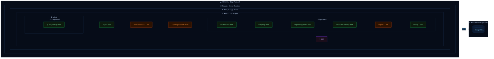

# Rendering Architecture

```mermaid
%%{init:{'theme':'base','themeVariables':{'background':'#060810','primaryColor':'#0c1a30','primaryTextColor':'#7dd3fc','primaryBorderColor':'#0e3a6e','edgeLabelBackground':'#0c1a30','lineColor':'#334155','secondaryColor':'#0f172a','clusterBkg':'#060c18','clusterBorder':'#1e3a5f','fontFamily':'JetBrains Mono','fontSize':'14'}}}%%
graph LR
  classDef ssr fill:#0d1a0d,stroke:#16a34a,color:#86efac
  classDef csr fill:#2d1200,stroke:#c2410c,color:#fb923c
  classDef ssg fill:#1a0d1a,stroke:#7c3aed,color:#c4b5fd
  classDef isr fill:#1a1a0d,stroke:#ca8a04,color:#fde047
  classDef ppr fill:#0d1a2d,stroke:#2563eb,color:#93c5fd
  classDef unk fill:#1a1a1a,stroke:#6b7280,color:#9ca3af
  classDef pkg fill:#0c1018,stroke:#475569,color:#cbd5e1
  classDef muted fill:#0a0d14,stroke:#374151,color:#64748b,stroke-dasharray: 3 3
  classDef hdr fill:#06080f,stroke:#1e3a5f,color:#7dd3fc
  subgraph INFRA["☁ VERCEL · Edge Network"]
    subgraph RUNTIME["⚙ Node.js · Server Runtime"]
      subgraph FRAMEWORK["▲ Next.js · App Router"]
        subgraph REACT["⚛ React · SSR Engine"]
          subgraph ADMIN_G["⚙ /admin"]
            subgraph ADMIN______SEGMENTS___G["📄 /[[...segments]]"]
              route_apps_cms_app__payload__admin______segments___page_tsx__admin______segments__["[[...segments]] · SSR"]:::ssr
            end
          end
          route_apps_overview_app_page_tsx__["/ · SSG"]:::ssg
          route_apps_portal_app__auth__login_page_tsx__login["/login · SSR"]:::ssr
          route_apps_portal_app__auth__reset_password_page_tsx__reset_password["/reset-password · CSR"]:::csr
          route_apps_portal_app__auth__update_password_page_tsx__update_password["/update-password · CSR"]:::csr
          subgraph _DEPARTMENT__G["📄 /[department]"]
            route_apps_portal_app__departments___department__breakdowns_page_tsx___department__breakdowns["breakdowns · SSR"]:::ssr
            route_apps_portal_app__departments___department__daily_log_page_tsx___department__daily_log["daily-log · SSR"]:::ssr
            route_apps_portal_app__departments___department__engineering_notes_page_tsx___department__engineering_notes["engineering-notes · SSR"]:::ssr
            route_apps_portal_app__departments___department__excavator_activity_page_tsx___department__excavator_activity["excavator-activity · SSR"]:::ssr
            route_apps_portal_app__departments___department__highres_page_tsx___department__highres["highres · CSR"]:::csr
            route_apps_portal_app__departments___department__history_page_tsx___department__history["history · SSR"]:::ssr
          end
          route_apps_portal_app__departments___department__breakdowns_page_tsx___department__breakdowns ~~~ route_apps_portal_app__departments___department__daily_log_page_tsx___department__daily_log ~~~ route_apps_portal_app__departments___department__engineering_notes_page_tsx___department__engineering_notes ~~~ route_apps_portal_app__departments___department__excavator_activity_page_tsx___department__excavator_activity ~~~ route_apps_portal_app__departments___department__highres_page_tsx___department__highres ~~~ route_apps_portal_app__departments___department__history_page_tsx___department__history
          ADMIN_G ~~~ route_apps_portal_app__auth__login_page_tsx__login ~~~ route_apps_portal_app__auth__reset_password_page_tsx__reset_password ~~~ route_apps_portal_app__auth__update_password_page_tsx__update_password ~~~ _DEPARTMENT__G
        end
      end
    end
  end
  subgraph BACKEND_0["⚙ Payload CMS · payload"]
    DB_0[("🐘 PostgreSQL")]
  end
  INFRA -.->|"REST"| BACKEND_0
```
