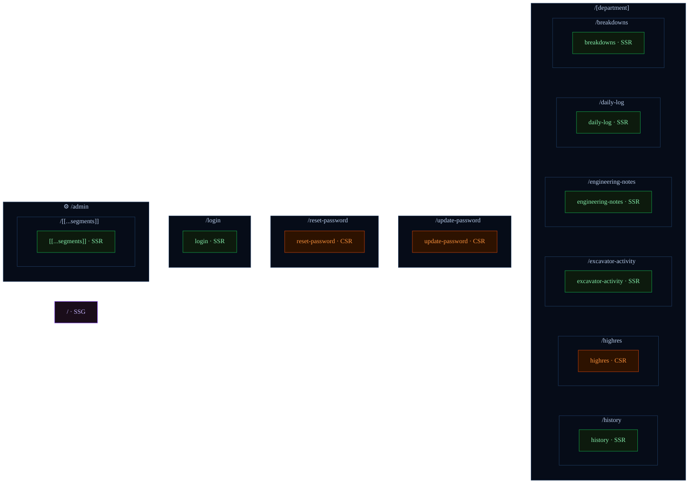

# Screen–Component Mapping

```mermaid
%%{init:{'theme':'base','themeVariables':{'background':'#060810','primaryColor':'#0c1a30','primaryTextColor':'#7dd3fc','primaryBorderColor':'#0e3a6e','edgeLabelBackground':'#0c1a30','lineColor':'#334155','secondaryColor':'#0f172a','clusterBkg':'#060c18','clusterBorder':'#1e3a5f','fontFamily':'JetBrains Mono','fontSize':'14'}}}%%
graph LR
  classDef ssr fill:#0d1a0d,stroke:#16a34a,color:#86efac
  classDef csr fill:#2d1200,stroke:#c2410c,color:#fb923c
  classDef ssg fill:#1a0d1a,stroke:#7c3aed,color:#c4b5fd
  classDef isr fill:#1a1a0d,stroke:#ca8a04,color:#fde047
  classDef ppr fill:#0d1a2d,stroke:#2563eb,color:#93c5fd
  classDef unk fill:#1a1a1a,stroke:#6b7280,color:#9ca3af
  classDef pkg fill:#0c1018,stroke:#475569,color:#cbd5e1
  classDef muted fill:#0a0d14,stroke:#374151,color:#64748b,stroke-dasharray: 3 3
  classDef hdr fill:#06080f,stroke:#1e3a5f,color:#7dd3fc
  subgraph ADMIN_T["⚙ /admin"]
    subgraph ADMIN______SEGMENTS___T["📄 /[[...segments]]"]
      route_apps_cms_app__payload__admin______segments___page_tsx__admin______segments__["[[...segments]] · SSR"]:::ssr
    end
  end
  route_apps_overview_app_page_tsx__["/ · SSG"]:::ssg
  subgraph LOGIN_T["📄 /login"]
    route_apps_portal_app__auth__login_page_tsx__login["login · SSR"]:::ssr
  end
  subgraph RESET_PASSWORD_T["📄 /reset-password"]
    route_apps_portal_app__auth__reset_password_page_tsx__reset_password["reset-password · CSR"]:::csr
  end
  subgraph UPDATE_PASSWORD_T["📄 /update-password"]
    route_apps_portal_app__auth__update_password_page_tsx__update_password["update-password · CSR"]:::csr
  end
  subgraph _DEPARTMENT__T["📄 /[department]"]
    subgraph _DEPARTMENT__BREAKDOWNS_T["📄 /breakdowns"]
      route_apps_portal_app__departments___department__breakdowns_page_tsx___department__breakdowns["breakdowns · SSR"]:::ssr
    end
    subgraph _DEPARTMENT__DAILY_LOG_T["📄 /daily-log"]
      route_apps_portal_app__departments___department__daily_log_page_tsx___department__daily_log["daily-log · SSR"]:::ssr
    end
    subgraph _DEPARTMENT__ENGINEERING_NOTES_T["📄 /engineering-notes"]
      route_apps_portal_app__departments___department__engineering_notes_page_tsx___department__engineering_notes["engineering-notes · SSR"]:::ssr
    end
    subgraph _DEPARTMENT__EXCAVATOR_ACTIVITY_T["📄 /excavator-activity"]
      route_apps_portal_app__departments___department__excavator_activity_page_tsx___department__excavator_activity["excavator-activity · SSR"]:::ssr
    end
    subgraph _DEPARTMENT__HIGHRES_T["📄 /highres"]
      route_apps_portal_app__departments___department__highres_page_tsx___department__highres["highres · CSR"]:::csr
    end
    subgraph _DEPARTMENT__HISTORY_T["📄 /history"]
      route_apps_portal_app__departments___department__history_page_tsx___department__history["history · SSR"]:::ssr
    end
  end
  _DEPARTMENT__BREAKDOWNS_T ~~~ _DEPARTMENT__DAILY_LOG_T ~~~ _DEPARTMENT__ENGINEERING_NOTES_T ~~~ _DEPARTMENT__EXCAVATOR_ACTIVITY_T ~~~ _DEPARTMENT__HIGHRES_T ~~~ _DEPARTMENT__HISTORY_T
  ADMIN_T ~~~ LOGIN_T ~~~ RESET_PASSWORD_T ~~~ UPDATE_PASSWORD_T ~~~ _DEPARTMENT__T
```
