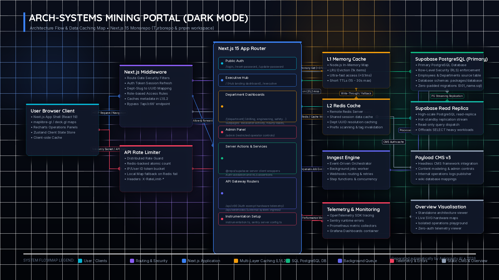
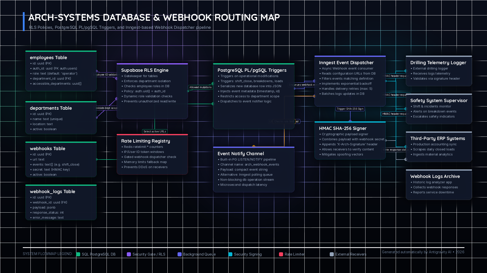
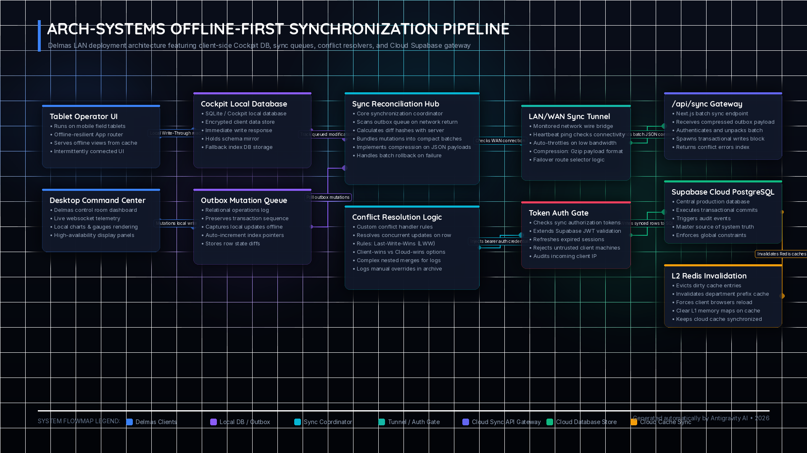
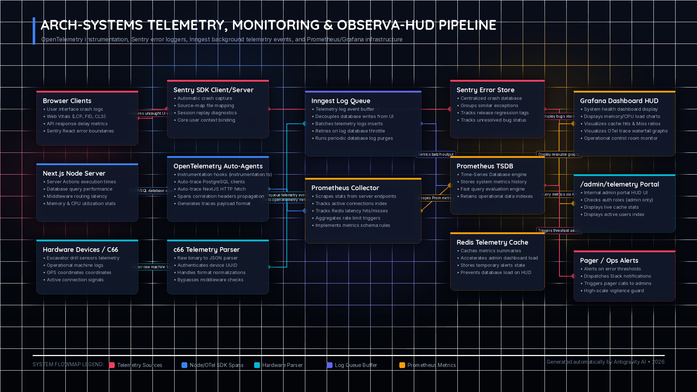

# Arch-Systems Portal: Cohesive System Architecture & Flow Map

This document presents the detailed architectural breakdown and data flows of the Next.js 15 monorepo system. To visualize these interactions, refer to the high-resolution architecture diagrams in the carousel below.

```carousel

<!-- slide -->

<!-- slide -->

<!-- slide -->

```

---

## 🏗️ Architectural Overview & Caching Mechanics

The Arch-Systems Mining Operations Portal is built as a highly scalable Next.js 15 monorepo running on Node.js (via Turborepo and `pnpm` workspaces). The application enforces strict security bounds, isolated department contexts, and sub-millisecond response guarantees through a multi-tier database and caching topology.

### ⚡ Caching Tier Breakdown

The caching system operates in a **Write-Through** pattern with two specific layers defined in `@repo/redis/cache`:

| Layer        | Type              | Mechanism                                                      | Latency         | TTL              | Purpose                                                                                   |
| :----------- | :---------------- | :------------------------------------------------------------- | :-------------- | :--------------- | :---------------------------------------------------------------------------------------- |
| **L1 Cache** | In-Memory (Node)  | JavaScript `Map` with custom LRU eviction (cap: 1,000 entries) | `< 0.1ms`       | `15s` - `30s`    | Absorbs heavy near-term repeat reads (e.g. middleware route checks).                      |
| **L2 Cache** | Distributed Redis | Remote Redis Cluster key-value store                           | `1.5ms` - `5ms` | `3600s` (1 hour) | Shared state cache across serverless functions (roles, department mappings, rate limits). |

> [!NOTE]
> When `cacheGet()` is called, L1 is queried first. On an L1 miss, L2 (Redis) is checked. If found in Redis, the L1 cache is instantly back-filled with a short 15-second TTL to accelerate near-term reads. On a double-miss, the primary database is queried, and both L1 and L2 are written to.

---

## 🗺️ Codebase & Data Flow Sequence

### 1. Request Gating and Security Filters

- **Next.js Proxy (`proxy.ts`)**: Every HTTP request is parsed by the proxy.
  - Auth checks are executed via `@repo/supabase/middleware`. If the token is invalid or expired, the L1 cache is evicted for that user (`arch:auth:employee:${user.id}`), and the user is redirected to `/login`.
  - Auth status and roles are cached under `arch:auth:employee:${user.id}` with a 1-hour TTL.
  - Department-slug resolution (e.g. mapping `/drilling` to UUID) is performed using the `dept:uuid:${slug}` cache key.
  - Hardware endpoints (`/api/c66`) bypass middleware verification.
- **API Rate Limiting (`rate-limit-middleware.ts`)**: Checks `ratelimit:${identifier}` in Redis on every API invocation. Falls back automatically to an in-memory Map structure if Redis goes offline.

### 2. Application Core (Next.js App Router)

Once the middleware allows a request, it is routed into the Next.js App Router:

- **Public/Auth Routes**: `/login`, `/reset-password`, `/update-password`.
- **Executive Hub**: Landing page (`/`) and `/executive` for high-level operations monitoring.
- **Department Dashboards (`/[department]`)**: Isolated spaces (e.g., `/drilling`, `/engineering`, `/production`) displaying real-time telemetry panels:
  - _Production analytics_: `excavator-activity`, `hourly-loads`, `operational-delays`.
  - _Geospatial / GIS_: `satellite`, `sar`, `hyperspectral`.
  - _Operational logbooks_: `daily-log`, `breakdowns`, `machines`, `shift-coverage`.
- **Admin Panel**: Restricted console (`/admin`) for user management and operations gating.

### 3. Backend & Data Layer

- **Supabase PostgreSQL (Primary)**: The primary database and single source of truth. Row-Level Security (RLS) is enabled on all tables, utilizing PostgreSQL triggers for department-aware audit routing.
- **Database Read Replica**: SELECT queries (heavy reads) are routed to a high-scale Read Replica (`SUPABASE_READ_REPLICA_URL`) to offload the primary database during shift handovers.
- **Inngest Event Engine**: Triggers asynchronous background jobs (e.g., webhook notifications, heavy operational calculations, periodic cleanup) without blocking HTTP response threads.
- **Payload CMS v3 & Standalone Overview**: Payload CMS is used for editing wiki articles and operations guidelines. The Standalone Overview provides read-only live SVG architecture visualizations.

---

## 🗄️ Database Schema & Webhook Event Flow

The system employs Row-Level Security (RLS) and custom triggers to handle events and delivery routing asynchronously:

- **Authorization Gating**: Enforced in the database level by comparing `auth.uid() = auth_id` against the `employees` table. Dynamic checks verify role clearance levels (`admin`, `supervisor`, `operator`).
- **PostgreSQL PL/pgSQL Triggers**: Listens to insertions or status modifications in operational schemas, generates a JSON payload, and posts to the `LISTEN/NOTIFY` channel.
- **Inngest Webhook Dispatcher**: An event receiver fetches URLs configured in the `webhooks` table, signs the payload using HMAC SHA-256 for secure verification, and posts it to external clients with automatic retries and exponential backoff.

---

## 🔄 Offline-First Delmas Synchronization Pipeline

For the on-premises Delmas LAN deployment, we support resilient offline operations:

- **Cockpit Local DB**: SQLite database running on LAN clients stores localized operational transactions.
- **Outbox Mutation Queue**: Intercepts modifications offline and queues them with sequential index ordering.
- **Sync Reconciliation Hub**: Resolves conflict indices on reconnection (Last-Write-Wins or customized merge parameters) and sends batch requests to the `/api/sync` gateway.
- **L2 Invalidation**: Successfully merged updates trigger key invalidation in the cloud L2 cache, alerting connected cloud clients.

---

## 📊 Telemetry, Monitoring & HUD Pipeline

Continuous vigilance is powered by a multi-channel instrumentation pipeline:

- **Sentry SDK integration**: Catches client-side UI and server exceptions, mapping stack traces back to releases.
- **OpenTelemetry Agent**: Tracks detailed spans for SQL queries, Redis hits, and NextJS routing timelines.
- **Metric Collectors**: Prometheus scrapes HTTP and server performance variables which are visualised in Grafana dashboards and the Next.js internal `/admin/telemetry` portal.

---

> [!TIP]
> The source scripts for compiling these images can be found in [generate_map.py](generate_map.py) and [generate_all_maps.py](generate_all_maps.py). Run `python3 report/generate_all_maps.py` to regenerate all four PNG maps.
